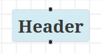

# Contributing to react-diagram-schema

Thank you for your interest in contributing! 🎉  
`react-diagram-schema` is a standalone CLI tool that generates a JSON schema from React source code, designed to integrate with [`react-diagram-visualizer`](https://github.com/AmiraBasyouni/react-diagram-visualizer) for visualizing [ReactFlow](https://reactflow.dev/)-based UML diagrams. We aim to make React component architecture more **visual, structured, and developer-friendly**, and your help can make a big difference.

## How to Get Started

1. Fork this repository:
   - visit [`react-diagram-schema`](https://github.com/AmiraBasyouni/react-diagram-schema)
   - click Fork at the top right of the repo page

   <!--- alternatively, if you have gh set up on your terminal, use the following command:
   ```bash
   gh repo fork AmiraBasyouni/react-diagram-schema
   ```
   --->

2. Clone your fork:

   ```bash
   git clone https://github.com/<your-username>/react-diagram-schema.git
   ```

   Note  
   🗒 replace `<your-username>` with your GitHub username.

3. Visit the root directory:

   ```bash
   cd react-diagram-schema
   ```

4. Install project dependencies:
   ```bash
   npm install
   ```

## How You Can Contribute

We welcome:

- **Bug fixes:** Spotted something weird? Open an issue or submit a fix.
- **Schema enhancements:** Improve how we extract data like props or states from React files.
- **Plugin ideas:** Suggest or prototype tools that consume the schema (e.g., a linter using the schema to enforce ‘no circular dependencies’ or a VS Code extension showing component trees).
- **Performance improvements:** Optimize parsing for large React projects.
- **Documentation updates:** Even fixing a typo helps!

Try to avoid:

- Large refactors without discussion.
- Adding unrelated dependencies.

## Proposing Changes

Before starting major work:

- **Open an issue** describing your proposal.
- If relevant, share an example schema and how your change would improve the output.

Small fixes (typos, minor code tweaks) can skip this step.

## Coding Standards

- **Formatting**: We use Prettier and ESLint. Run `npm run lint` and `npm run format` before submitting.
- **File Naming**: camelCase for utilities, and kebab-case for core modules.
- **Schema Shape**: Keep the structure consistent with the current spec:

   ```js
   {"ComponentName::filepath": {"name": "App", "descendants": ["Header"], "location": {"line": 7}}}
   ```

   Note  
   🗒 This is a simplified example.
   🗒 To see the full schema specification, visit [ROADMAP.md](https://github.com/AmiraBasyouni/react-diagram-schema).

## Pull Requests

1. **Branch** from main:

   ```bash
   git checkout -b fix-bug-header
   ```

2. **Write commits in [Conventional Commits](https://www.conventionalcommits.org/) style**:  
   Use a prefix like `fix`, `feat`, or `docs`, followed by the scope (choose a relevant scope, such as `extractMetadata`, `readme`) and add a brief description.

   Examples:

- `fix(extractMetadata): improve props parsing for RestElement`
- `feat: add support for React.lazy components`
- `docs(readme): clarify multi-file parsing usage`

3. **Push** your branch and open a pull request on GitHub.

4. Include **screenshots or schema output** in your pull request if your changes affect parsing or visualization (e.g., new schema fields or diagram updates).

## Testing your Changes

`react-diagram-schema` includes an automated test suite powered by [Jest](https://jestjs.io/)

**Running the tests**

To run all tests:

```bash
npm test
```

To run a specific test file:

  ```bash
  npx jest test/components.test.jsx
  ```

---

**Test types included**

- **Component detection tests**:  
  Validate that function-defined and inline components are correctly parsed.

- **Data extraction tests**:  
  Ensure props, states, context, and functions are accurately extracted from components.

- **Edge case tests**:  
  Handle tricky structures like nested components, default exports, and files with missing metadata.

---

**Adding new tests**

- Add test files under the `tests/` directory. Use a feature-based structure (e.g. `components.test.jsx`, `dataExtraction.test.jsx`, `edgeCases.test.jsx`).

- Use `parseCode(code, filePath)` as your entry point for schema generation.

- Keep tests isolated and easy to understand.  
  Example:

  ```JavaScript
  expect(result["MyComponent::file.js"].external.props).toContain("title");
  ```

- Prefer `Object.keys(result)` to validate which components are detected.  
  Example:
  ```js
  const keys = Object.keys(result);
  expect(keys).toContain(`App::${fakePath}`);
  ```

---

**Manual testing**

Automated tests catch most issues, but you can also test the CLI manually.

🔦 **Try parsing a single component**

1. Follow the [How To Get Started](#how-to-get-started) instructions.

2. Inside `./react-diagram-schema/`, create a `playground/` directory:

   ```bash
   mkdir playground
   ```

3. Visit the `playground/` directory:

   ```bash
   cd playground
   ```

4. Create a file `Header.jsx`

   ```bash
   touch Header.jsx
   ```

5. Edit the file by adding this component:

   ```JavaScript
   function Header(){
     return <h1>Hello World!</h1>;
   }
   ```

6. Run the parser on this component with the debug flag:

   ```bash
   node ../src/build-schema.js ./playground/ Header --debug
   ```

7. The console output should look as follows:

   ```js
   {
     'Header::Header.jsx': {
       name: 'Header',
       description: '',
       descendants: [],
       internal: { states: [], functions: [] },
       external: { props: [], context: [], constants: [] },
       defaultExport: false,
       location: { line: 1, filepath: 'Header.jsx' },
       unresolvedDescendants: undefined
     }
   }
   ```

   Note  
   🗒 The `playground/` directory will be ignored.  
   🗒 Changes made to the `playground/` directory should not be committed.

---

🗃️ **Try parsing a repository**

1. Follow the [How To Get Started](#how-to-get-started) instructions.

2. Inside the root directory, create a symbolic link:

   ```bash
   npm link
   ```

   Note  
   🗒 The symbolic link makes `react-diagram-schema` globally accessible.  
   🗒 To view npm links, run `npm ls -g --link`.  
   🗒 After testing, you can remove the link by running `npm unlink -g react-diagram-schema`.

3. Leave `react-diagram-schema`'s root directory (in other words, go one level up):

   ```bash
   cd ../
   ```

4. Clone a React repository (e.g. [`xyflow`](https://github.com/xyflow/xyflow)):

   ```bash
   git clone https://github.com/xyflow/xyflow.git
   ```

5. Run the parser against the cloned repository:

   ```bash
   build-schema ./xyflow/examples/react/src/App/
   ```

   Note  
   🗒 Adjust the arguments as needed (the first for the entry directory/file, and optionally the second for the root component name).

6. Open and inspect the generated `schema.json` file from your current working directory.

   Note
   🗒 The parser writes `schema.json` to the current working directory (where you ran the command).

   Check for:
   - The number of components detected.
   - Any missing or unresolved descendants.
   - Warnings or errors in the console

   Note  
   🗒 If performance issues occur, feel free to open an issue to discuss improvements.

7. (Recommended) Visualize the schema with [`react-diagram-visualizer`](https://github.com/AmiraBasyouni/react-diagram-visualizer) to see how the component tree renders.

---

**Visualizing the output**

You can visualize `schema.json` using [react-diagram-visualizer](https://github.com/AmiraBasyouni/react-diagram-visualizer)

1. Clone the visualizer:

   ```bash
   git clone https://github.com/AmiraBasyouni/react-diagram-visualizer.git
   ```

2. Visit the root directory and install dependencies:

   ```bash
   cd react-diagram-visualizer
   ```

   ```bash
   npm install
   ```

3. Place your `schema.json` file inside the `src/` folder.

   ```bash
   mv ../schema.json ./src/
   ```

   Note  
   🗒 Adjust the first argument to match your `schema.json` file's location.

4. Run the visualizer:

   ```bash
   npm run dev
   ```

   You'll see a diagram rendered using ReactFlow.
   The diagram for `Header.jsx` should look like this (confirming the parser and visualizer are correctly wired):  
   

   Note  
   🗒 If any modifications are made to the `schema.json` file: close the diagram, stop the visualizer with `Ctrl+c`, then run `npm run dev` again to see the updates in the diagram.

## New to Open Source?

Start with small tasks like improving error messages (e.g., ‘Invalid path’) or fixing typos in docs.

## Roadmap & Features

To view planned features and priorities, visit the [ROADMAP.md](https://github.com/AmiraBasyouni/react-diagram-schema/blob/main/ROADMAP.md) file.  

We welcome discussions of new ideas!  
If you have a suggestion, feel free to open an issue or comment on an existing one.

## Questions?

- **Issues**: Open a [GitHub Issue](https://github.com/AmiraBasyouni/react-diagram-schema/issues).
- **Discussions**: Start a thread under [Discussions](https://github.com/AmiraBasyouni/react-diagram-schema/discussions) (coming soon).

## Thank you

Every contribution counts. Whether it's code, feedback, or docs!
