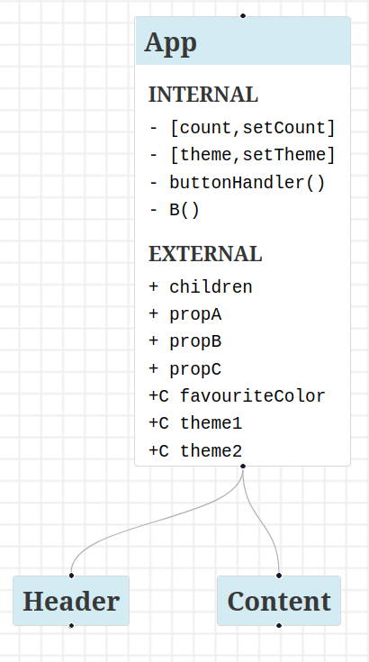

# react-diagram-schema

`react-diagram-schema` is a CLI tool that transforms React source code into a JSON schema. The schema can be handed to [react-diagram-visualizer](https://github.com/AmiraBasyouni/react-diagram-visualizer) (a [ReactFlow](https://reactflow.dev/) based tool that renders the schema as an interactive UML-style diagram)

## Table of Contents

- [Limitations](#limitations)
- [Installation](#installation)
- [Usage](#usage)
- [Example Usage](#example-usage)
- [Flags](#flags)
- [Troubleshooting](#troubleshooting)
- [About JSON Schema](#about-json-schema)
- [Roadmap](#roadmap)
- [Contributing](#contributing)
- [License](#license)

## Limitations

This CLI tool currently only supports parsing `.js` / `.jsx` files, with plans to support `.ts` / `.tsx` files in the future. To learn more regarding next steps and future plans, check out the [ROADMAP.md](https://github.com/AmiraBasyouni/react-diagram-schema/blob/main/ROADMAP.md) document.

**Dependencies**

- [@babel/parser](https://www.npmjs.com/package/@babel/parser) - Parses JavaScript code into an AST
- [@babel/traverse](https://www.npmjs.com/package/@babel/traverse) - Walks the AST and extracts component data

## Installation

**To Install Locally:**

```bash
git clone https://github.com/AmiraBasyouni/react-diagram-schema
```

```bash
cd react-diagram-schema
```

```bash
npm install
```

**To Install Globally:**

```bash
npm install -g AmiraBasyouni/react-diagram-schema
```

## Usage

**If Not Installed, Use:**

```bash
npx AmiraBasyouni/react-diagram-schema ./src/ App
```

_replace `./src/` with your application's entry directory._  
_`App` represents the root React component living in your entry directory._

---

**If Installed Locally, Use:**  
generate the test schema within `react-diagram-schema`'s root folder using:

```bash
./src/build-schema ./test-components/ App
```

---

**If Installed Globally, Use:**  
generate the schema from any directory using:

```bash
build-schema ./src/ App
```

_replace `./src/` with your application's entry directory._  
_`App` represents the root React component, defined in the entry directory's main file._

## Example Usage

**Scenario:** You have installed `react-diagram-schema` locally on your device. You are in the repository's root folder.

**You run the command:** `./src/build-schema ./test-components/ App`

**A schema.json file is created containing the following:**

```json
{
  "App::../test-components/App.js": {
    "name": "App",
    "description": "",
    "descendants": [
      "Header::../test-components/Header.js",
      "Content::../test-components/App.js"
    ],
    "internal": {
      "states": [
        ["count", "setCount"],
        ["theme", "setTheme"]
      ],
      "functions": ["buttonHandler", "B"]
    },
    "external": {
      "props": ["children", "propA", "propB", "propC"],
      "context": [
        {
          "source": "FavouriteColorContext",
          "values": ["favouriteColor"]
        },
        {
          "source": "FavouriteThemeContext",
          "values": ["theme1", "theme2"]
        }
      ],
      "constants": []
    },
    "location": {
      "line": 7,
      "filepath": "../test-components/App.js"
    }
  },
  "Content::../test-components/App.js": {
    "name": "Content",
    "description": "",
    "descendants": [],
    "internal": {
      "states": [],
      "functions": []
    },
    "external": {
      "props": [],
      "context": [],
      "constants": []
    },
    "location": {
      "line": 43,
      "filepath": "../test-components/App.js"
    }
  },
  "Header::../test-components/Header.js": {
    "name": "Header",
    "description": "",
    "descendants": [],
    "internal": {
      "states": [],
      "functions": []
    },
    "external": {
      "props": [],
      "context": [],
      "constants": []
    },
    "location": {
      "line": 3,
      "filepath": "../test-components/Header.js"
    }
  }
}
```

Visit [react-diagram-visualizer](https://github.com/AmiraBasyouni/react-diagram-visualizer) for instructions on how to render a schema as an interactive diagram.  

The above schema should give you the following diagram:


You can also pass the schema to custom tools for analysis.

## Flags

**Silence**  
Purpose: mutes error and warning console messages.  
Usage: append `--silent` or `--quiet` to the end of your command like so:

```bash
build-schema ./components/App App --silent
```

**Verbose**  
Purpose: prints all error and warning console messages.  
Usage: append `--verbose` to the end of your command like so:

```bash
build-schema ./components/App App --verbose
```

## Troubleshooting

```
Error: (build-schema) invalid path "undefined", please provide a valid directory as your first argument (e.g. "./src")
```

This error could indicate one of the following:

1. you forgot to pass a first argument to the `build-schema` executable.
2. you passed an invalid first argument to the `build-schema` executable.

- _**Hint:** Make sure your first argument is a valid directory path (e.g. `./components`)_

---

```
Error: (build-schema) invalid component name "undefined", please provide a valid component's name as your second argument (e.g. "App")
```

This error could indicate one of the following:

1. you forgot to pass a second argument to the `build-schema` executable.
2. you passed an invalid second argument to the `build-schema` executable.

- _**Hint:** Make sure your second argument is the name of the component defined in your main file (e.g. App defined in App.js or ComponentName defined in index.js)_

---

```
Error: (isFile) Error: ENOENT: no such file or directory, stat '../react-feather'
```

This error could indicate one of the following:

1. you've imported an npm package that does not exist in your local directory
2. your import statement references a file path that does not exist

- _**Hint:** in scenario 1, you can safely ignore this error message. Otherwise, check if the file path referenced in your import statement exists_

---

```
WARNING: (build-schema) the descendant <descendant-name> of component <component-name> could not be resolved within the file <file-path>
```

This warning could indicate one of the following:

1. the import statement of `<descendant-name>` is missing or could not be parsed.

- _**Hint:** check if an import statement of `<descendant-name>` exists. If so, check if the format of your import statement is supported by the parser_

---

```
WARNING: (build-schema) could not resolve file path from directory <directory> with the import path <file-path> for component <component-name>
```

This warning could indicate one of the following:

1. the file indicated in `<file-path>` does not exist or could not be found by the parser.
2. the descendant was declared with an in-line function, which is not currently supported.

- _**Hint:** Look for the file indicated in `<file-path>`. If it exists, check if `<component-name>` was declared as an in-line function_

## About JSON Schema

- Stores **general** data such as:
  - a component's name
  - description about the component's purpose (which will be integrated using in-line comments)
  - a component's descendants (the component's direct children)
  - a component's location, specifically the file path and declaration line

---

- Stores **internally defined** data such as:
  - states and state setters
  - function declarations

---

- Stores **externally defined** data such as:
  - props
  - context dependencies
  - constants (which will be integrated in future releases)

---

- Describes your app’s structure
- Can power other tools or workflows; feel free to reuse it however you like
- Integrates seamlessly with [react-diagram-visualizer](https://github.com/AmiraBasyouni/react-diagram-visualizer) (a [ReactFlow](https://reactflow.dev/) based tool that renders the schema as an interactive UML-style diagram)

## Roadmap

Please visit [ROADMAP.md](https://github.com/AmiraBasyouni/react-diagram-schema/blob/main/ROADMAP.md) to view the project's progress, and planned features.

## Contributing

Please visit [CONTRIBUTING.md](https://github.com/AmiraBasyouni/react-diagram-schema/blob/main/CONTRIBUTING.md) to learn about how you can contribute to `react-diagram-schema`.

## License

[MIT](https://raw.githubusercontent.com/AmiraBasyouni/react-diagram-schema/refs/heads/main/LICENSE.md)
